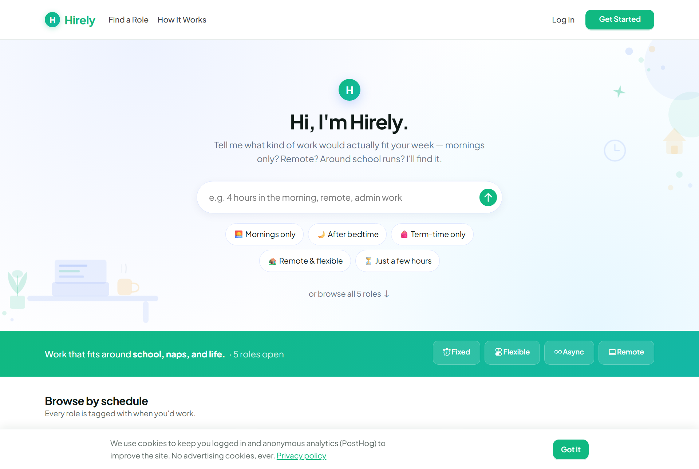
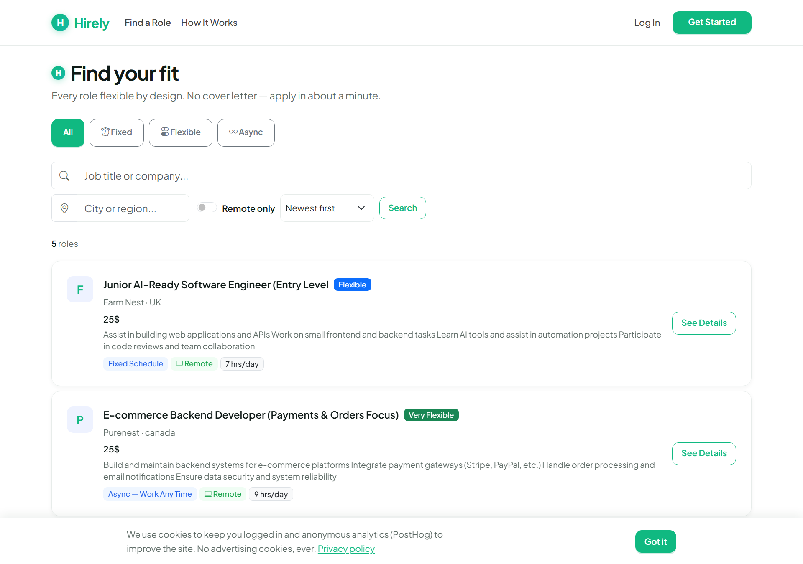
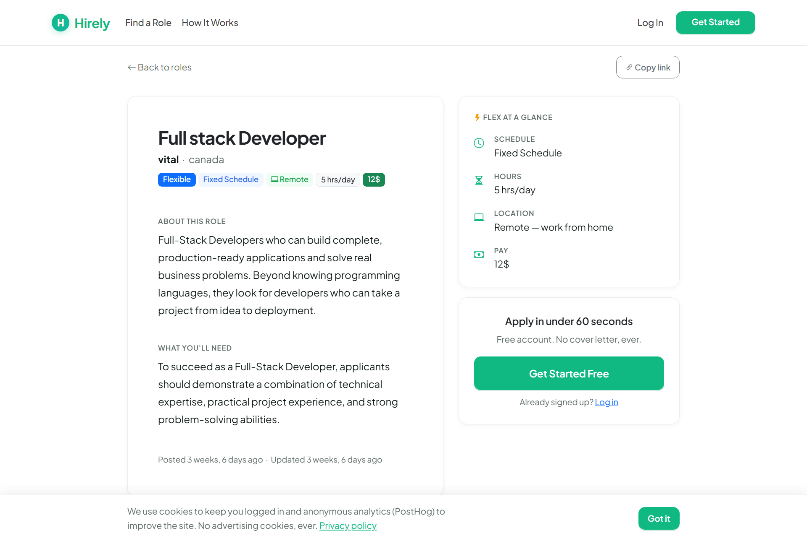

# Hirely — AI-Powered Flexible Jobs Platform for Busy Parents

> A full-stack job marketplace where **flexibility is structured data, not buried in descriptions** — with an AI agent layered through the whole hiring loop, from chat-based job search to résumé parsing, candidate matching, and employer screening.

<p align="center">
  
  
  
  
  <a href="https://github.com/virginiamwega2-svg/hirely/actions/workflows/ci.yml"></a>
</p>

**🔗 Live demo:** https://hirely-a0lx.onrender.com/ &nbsp;·&nbsp; _hosted on Render free tier — first load may take ~30s to wake the server._



---

## Why this project

Most job boards treat flexibility as free text, forcing parents and caregivers to open dozens of listings just to learn whether a role fits a school run or childcare window. Hirely makes **flexibility a first-class, structured concept** — schedule type (Fixed / Flexible / Async), remote options, and hours/day — and then wraps the entire experience in an AI agent so people can simply *ask* for what they need instead of hunting through filters.

It's built to demonstrate real product thinking and production engineering: a working LLM product with grounded tool use, graceful degradation, caching, CI/CD, and scheduled automation — not a CRUD demo.

---

## ✨ AI features (the core differentiator)

All AI runs on **Claude Haiku 4.5** (`claude-haiku-4-5-20251001`) via the Anthropic API, with a friendly fallback whenever the key or credits are unavailable — the app never hard-fails on a missing model.

### Conversational discovery
- **Chat-first homepage hero** — an AI agent answers natural-language requests ("afternoons only, near schools") using a `search_jobs` tool **grounded in the live Job table**, so it can only surface real roles.
- **"Is this for me?" panel** on every job detail page — grounded Q&A scoped to that single role.

### Candidate (parent) flow
- **AI-drafted personal note** in the apply form, with tone chips (warm / confident / brief).
- **Résumé parsing on upload** → a structured profile (years of experience, top skills, location hint, schedule preference, summary) using `pdfminer.six` / `python-docx`.
- **"Top matches for you"** on the logged-in home — roles scored by Claude against the parsed profile, **cached per profile version**.
- **Interview coaching** on accepted applications — 5 role-specific questions + parent-friendly tips.

### Employer flow
- **Auto-screening** on the applicant list — "Suggest action" produces a one-line summary + a shortlist / hold / decline chip, **cached on the application**.
- **AI-drafted empathy emails** on accept/reject status changes, with a hand-written fallback when AI is unavailable.

### Scheduled automation (cron)
- **Weekly digest** (Mondays 09:00 UTC) — personalised job alerts with an AI intro tailored to each parent's past applications.
- **Stale-job nudge** (Sundays 18:00 UTC) — one AI-drafted improvement suggestion per quiet role.

---

## 📸 Screenshots

| Chat-first home | Job listings | Job detail |
|---|---|---|
|  |  |  |

> _Coming: AI chat conversation, candidate dashboard with "Top matches", and employer applicant-screening view._

---

## Core platform features

**Candidate experience**
- Job search with structured flexibility filters, sorting, and pagination
- "Flex at a glance" decision-focused job detail layout
- One-step apply flow (optional résumé upload, no cover-letter friction)
- Application status timeline (Pending / Seen / Accepted / Rejected)

**Employer experience**
- Post, edit, delete, and toggle visibility (live/inactive) on roles
- Applicant review with status updates and pagination
- Lightweight hiring dashboard

**Authentication**
- Email registration & login, password reset
- **Google Sign-In** via `django-allauth`

---

## 🛠 Tech stack

| Layer | Tools |
|---|---|
| **AI / LLM** | Anthropic Claude Haiku 4.5 — grounded tool use, caching, graceful fallback |
| **Backend** | Python 3.12, Django 6 |
| **Frontend** | Django templates, Bootstrap 5, crispy-forms |
| **Database** | PostgreSQL (prod via `DATABASE_URL`), SQLite (local) |
| **Parsing** | pdfminer.six, python-docx |
| **Auth** | django-allauth (email + Google OAuth) |
| **Email** | Resend SMTP |
| **DevOps** | Gunicorn, WhiteNoise, Render (blueprint + cron), GitHub Actions CI/CD |

---

## 🧠 Engineering highlights (interview talking points)

- **Grounded AI, not hallucinated** — the chat agent answers only through a `search_jobs` tool bound to the database, so it can't invent jobs that don't exist.
- **Graceful degradation** — every AI surface has a non-AI fallback, so an empty/expired API key downgrades the UX instead of breaking it.
- **Cost-aware caching** — match scores and screening decisions are cached (per profile version / per application) so the same Claude call isn't paid for twice.
- **Derived signals** — a computed "flexibility score" from normalized fields keeps the UI consistent without extra columns.
- **Query performance** — `select_related`, `annotate`, and `Paginator` keep list/detail views efficient.
- **Security-aware** — validated redirect targets, secure cookies + HSTS when `DEBUG=False`, reverse-proxy TLS via `SECURE_PROXY_SSL_HEADER`.
- **Real CI/CD** — GitHub Actions runs tests, a missing-migration check, `collectstatic`, and `check --deploy`, then triggers a Render deploy hook on `main`.

---

## 🚀 Local setup (Windows / PowerShell)

```powershell
# 1. Virtual environment
python -m venv venv
.\venv\Scripts\Activate.ps1

# 2. Dependencies
pip install -r requirements.txt

# 3. Environment — copy and edit
copy .env.example .env
#   SECRET_KEY=your-secret-key
#   DEBUG=True
#   ALLOWED_HOSTS=127.0.0.1,localhost
#   ANTHROPIC_API_KEY=sk-ant-...   (optional — AI features fall back gracefully without it)

# 4. Migrate & run
python manage.py migrate
python manage.py runserver
```

App: http://127.0.0.1:8000/ · Admin: http://127.0.0.1:8000/admin/

### Environment variables

| Required | Common | AI | Email |
|---|---|---|---|
| `SECRET_KEY` | `DEBUG`, `ALLOWED_HOSTS`, `DATABASE_URL` | `ANTHROPIC_API_KEY` | `EMAIL_HOST*`, `DEFAULT_FROM_EMAIL` |

---

## ✅ Tests & CI

```powershell
python manage.py test --verbosity=2
```

GitHub Actions ([`.github/workflows/ci.yml`](.github/workflows/ci.yml)) runs on every push/PR: tests → missing-migration check → production `collectstatic` → Django `check --deploy`, then auto-deploys `main` to Render.

---

## 🗺 Roadmap

- [ ] Save-for-later (bookmark roles)
- [ ] Semantic search with pgvector — upgrade chat from keyword matching to true intent matching
- [ ] "Help me write this role" AI autofill for employers
- [ ] Analytics + error monitoring (PostHog / Sentry)
- [ ] Smart instant alerts — push a strong match within 30 min instead of weekly

---

## Project structure

```
hirely/        # Django project (settings, urls, wsgi)
jobs/          # Core app — models, views, AI logic, resume_parser, management commands
templates/     # HTML templates
static/        # CSS, JS, assets
docs/          # Screenshots & case study
```

See [`PORTFOLIO.md`](PORTFOLIO.md) for the full case study.

---

## Author

**Virginia Mwega** — full-stack developer building practical, AI-powered tools for real people. Combining product thinking with production backend engineering.
